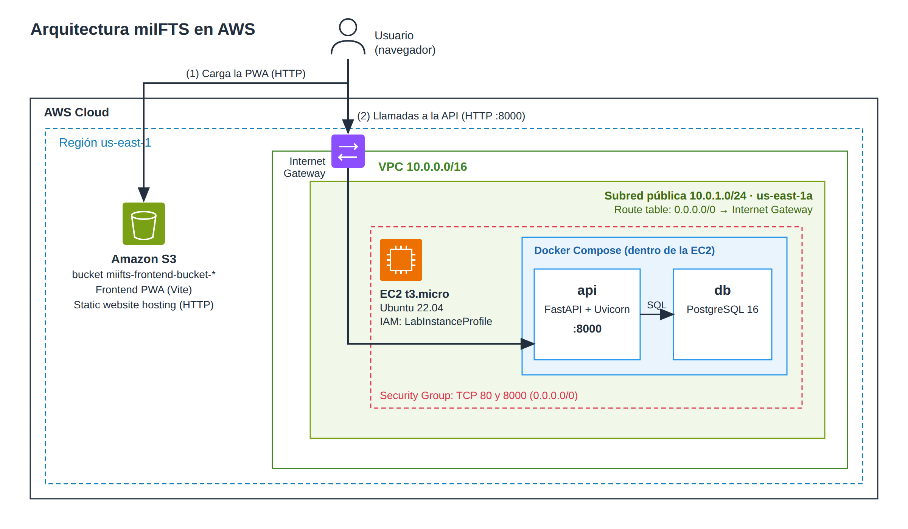

# Despliegue de miIFTS en AWS Academy (Learner Lab)

Guía rápida para desplegar miIFTS (backend en EC2 + frontend en S3) desde AWS CloudShell, y para eliminar todo al terminar.

Región usada: `us-east-1`.

> Si algo falla en cualquier etapa, ejecutá `etapa_4_cleanup.sh` y empezá de nuevo desde la etapa 1.

## Requisitos

- Un laboratorio de AWS Academy Learner Lab iniciado (esperá a que la luz se ponga verde).
- Acceso a CloudShell desde la consola de AWS (con node y npm disponibles, que ya vienen incluidos).
- El rol `LabInstanceProfile`, que el Learner Lab ya provee. Lo necesita la instancia EC2 para recibir comandos por Systems Manager (SSM).

## Pasos

1. Abrí CloudShell desde la consola de AWS.
2. Traé los scripts a CloudShell, clonando este repositorio o subiendo los archivos con *Actions → Upload file*:
   ```bash
   git clone https://github.com/aka-leonel/mi_ifts_deployment
   cd mi_ifts_deployment
   ```
3. Ejecutá las etapas **en orden y de a una**, esperando que cada una termine antes de lanzar la siguiente:
   ```bash
   bash etapa_1_infraestructura_cloud.sh
   bash etapa_2_backend.sh
   bash etapa_3_frontend.sh
   ```
4. Al terminar, la etapa 3 imprime la URL de la PWA. La API queda en `http://<IP-pública>:8000` (la documentación en `/docs`).

> **IMPORTANTE:** para liberar recursos y no consumir tus créditos, ejecutá al finalizar:
> ```bash
> bash etapa_4_cleanup.sh
> ```

## Arquitectura final desplegada




## Detalle de cada etapa

### etapa_1_infraestructura_cloud.sh
Crea la VPC, la subred pública, el Internet Gateway, la tabla de ruteo, el Security Group y la instancia EC2 (Ubuntu 22.04, `t3.micro`). Todos los recursos llevan tag `Name` con prefijo `miifts`.

- El Security Group abre solo los puertos **80** y **8000**. No se abre el 22: el acceso a la instancia es por SSM.
- Guarda cada ID en `~/miifts-ids.sh` apenas crea el recurso, para que las etapas siguientes lo reutilicen.
- Si detecta que ya existe `~/miifts-ids.sh`, **no se ejecuta**: significa que hay un despliegue sin limpiar. Corré primero la etapa 4.

### etapa_2_backend.sh
Espera a que la instancia esté registrada en SSM y le envía, mediante Systems Manager, un script que:

1. Instala Docker y Docker Compose.
2. Clona la rama `dev` del backend (`backend-ifts`).
3. Crea el archivo `.env`.
4. Levanta los contenedores con Docker Compose.
5. Espera a que la API responda y ejecuta `seed.py` **una sola vez** para poblar la base de datos.

Al final verifica desde CloudShell que el backend responde en `http://<IP-pública>:8000`. Puede tardar varios minutos (instalación de Docker y build de la imagen). Si el despliegue falla, la etapa termina con error.

### etapa_3_frontend.sh
Clona el frontend (`frontend-miifts`, rama `dev`) en `~/frontend-miifts`, configura `VITE_API_URL` con la IP pública del backend, compila con Node.js (Vite) y publica `dist/` en un bucket de S3 con acceso público de lectura y hosting web estático.

- El nombre del bucket (`miifts-frontend-bucket-<timestamp>`) se guarda en `~/miifts-ids.sh`. Si repetís la etapa, reutiliza ese bucket en vez de crear otro.
- Requiere haber ejecutado antes las etapas 1 y 2.

### etapa_4_cleanup.sh
Elimina todos los recursos de miIFTS **buscándolos por tag/nombre**, sin depender de `~/miifts-ids.sh`. Por eso también limpia restos de ejecuciones anteriores que hayan fallado a mitad. Solo toca recursos `miifts-*` y nunca la VPC default. Elimina, en este orden:

1. Los buckets de S3 `miifts-frontend-bucket-*` (con todo su contenido).
2. Las instancias EC2 `miifts-backend`.
3. Por cada VPC `miifts-vpc`: Security Groups, subredes, tablas de ruteo, Internet Gateway y la VPC.

Al final verifica que no quede nada y borra `~/miifts-ids.sh`. Si quedó algún recurso, termina con error: se puede volver a ejecutar sin problema.

## El archivo `~/miifts-ids.sh`

Las etapas se comunican mediante `~/miifts-ids.sh` (en el home de CloudShell), que guarda variables como `VPC_ID`, `INSTANCE_ID`, `PUBLIC_IP` y `BUCKET_NAME`.

**Lo genera la etapa 1 automáticamente y no hay que crearlo ni editarlo a mano.** Crearlo antes de la etapa 1 hace que esta se niegue a ejecutarse. No hace falta recuperarlo para limpiar: la etapa 4 no lo necesita.

## Notas

- Es un entorno de aprendizaje: el backend queda expuesto por HTTP en el puerto 8000, con credenciales de base de datos por defecto y `CORS_ORIGINS=*`. No lo uses en producción tal cual.
- La instancia no tiene IP elástica. Si el laboratorio se reinicia y la instancia se detiene y vuelve a arrancar, la IP pública puede cambiar, y el frontend queda apuntando a la IP vieja. En ese caso, limpiá y desplegá de nuevo.