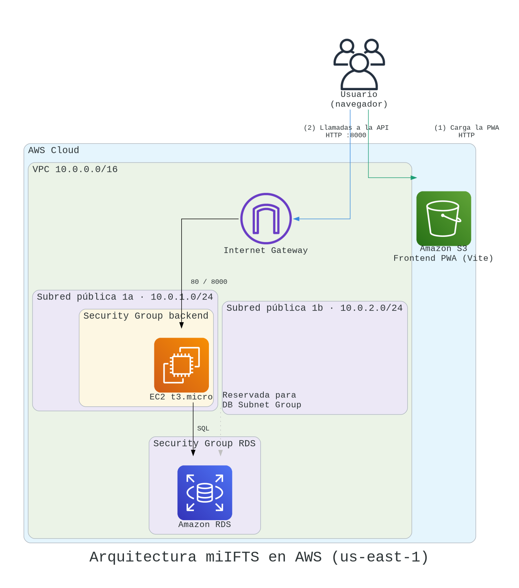

# Despliegue de miIFTS en AWS Academy (Learner Lab) - Arquitectura con RDS

Guía rápida para desplegar miIFTS (**backend en EC2 + base de datos en Amazon RDS + frontend en S3**) desde AWS CloudShell, y para eliminar todo al terminar.

Región usada: `us-east-1`.

> Si algo falla en cualquier etapa de la 1 a la 3, ejecutá `./etapa_4_cleanup.sh` 2 (dos) veces y empezá de nuevo desde la etapa 1. La etapa 0 no hace falta repetirla: tus secretos se conservan en `~/miifts-secrets.sh`.

## Requisitos

- Un laboratorio de AWS Academy Learner Lab iniciado (esperá a que la luz se ponga verde).
- Acceso a CloudShell desde la consola de AWS (con `node`, `npm`, `git`, `openssl` y `python3` disponibles, que ya vienen incluidos).
- El rol `LabInstanceProfile`, que el Learner Lab ya provee. Lo necesita la instancia EC2 para recibir comandos por Systems Manager (SSM).
- Una cuenta de **Brevo** con credenciales SMTP (usuario y clave SMTP, en *SMTP y API → SMTP*), usadas para enviar el mail de recuperación de contraseña.

## Pasos

1. Abrí CloudShell desde la consola de AWS.

2. Traé los scripts a CloudShell clonando la rama `dev` (o editalo con la rama que quieras probar) de este repositorio, o subiendo los archivos con *Actions → Upload file*:
   ```bash
   git clone -b dev https://github.com/aka-leonel/mi_ifts_deployment.git
   cd mi_ifts_deployment
   ```

3. Dale permiso de ejecución (`chmod +x`) a cada script:
   ```bash
   chmod +x etapa_0_secrets.sh
   chmod +x etapa_1_infraestructura_cloud.sh
   chmod +x etapa_2_backend.sh
   chmod +x etapa_3_frontend.sh
   chmod +x etapa_4_cleanup.sh
   ```

4. Ejecutá las etapas **en orden y de a una**, esperando que cada una termine antes de lanzar la siguiente (tené en cuenta que la creación de Amazon RDS en la etapa 1 puede tardar varios minutos):
   ```bash
   ./etapa_0_secrets.sh      # solo la primera vez: pide por consola las credenciales SMTP de Brevo
   ./etapa_1_infraestructura_cloud.sh
   ./etapa_2_backend.sh
   ./etapa_3_frontend.sh
   ```

5. Al terminar, la etapa 3 imprime la URL de la PWA. La API queda en `http://<IP-pública>:8000` (la documentación en `/docs`).

6. Liberar recursos

> **IMPORTANTE:** para liberar recursos y no consumir tus créditos, ejecutá al finalizar:
> ```bash
> ./etapa_4_cleanup.sh
> ```

## Arquitectura final desplegada

*(Nota: La base de datos PostgreSQL ya no vive dentro de Docker en la EC2, sino de forma desacoplada en un servicio administrado Amazon RDS).*



## Detalle de cada etapa

### etapa_0_secrets.sh
Genera el archivo `~/miifts-secrets.sh` (en el home de CloudShell, con permisos `600`) que la etapa 2 necesita. **El script no contiene ningún secreto**, por eso se puede versionar en GitHub: los valores se generan o se piden en el momento.

- `SECRET_KEY` y las claves VAPID (`VAPID_PUBLIC_KEY`, `VAPID_PRIVATE_KEY`, para notificaciones push) **se generan automáticamente** con `openssl`.
- `SMTP_USER` y `SMTP_PASSWORD` (Brevo) **se piden por consola**; la clave no se muestra al escribirla.
- Si `~/miifts-secrets.sh` ya existe, pregunta qué querés cambiar (regenerar `SECRET_KEY` y VAPID, volver a ingresar el SMTP, o ambos). Si respondés que no a todo, no modifica nada, así que se puede volver a ejecutar sin riesgo.
- Regenerar `SECRET_KEY` cierra las sesiones activas, y regenerar las claves VAPID invalida las suscripciones push existentes.
- La etapa 4 **no** borra este archivo, para que las claves se conserven entre despliegues.

### etapa_1_infraestructura_cloud.sh
Crea la VPC, dos subredes públicas (en distintas zonas de disponibilidad para cumplir con los requisitos de RDS), el Internet Gateway, la tabla de ruteo, los Security Groups, la instancia EC2 (Ubuntu 22.04, `t3.micro`) y la base de datos **Amazon RDS (PostgreSQL 16)**. Todos los recursos llevan tag `Name` con prefijo `miifts`.

- Configura dos Security Groups separados: uno para la EC2 (puertos **80** y **8000** abiertos al público) y otro exclusivo para RDS (puerto **5432** accesible únicamente desde el Security Group de la EC2).
- Guarda cada ID y el endpoint de la base de datos en `~/miifts-ids.sh` apenas se crean, para que las etapas siguientes los reutilicen.
- Si detecta que ya existe `~/miifts-ids.sh`, **no se ejecuta**: significa que hay un despliegue sin limpiar. Corré primero la etapa 4.

### etapa_2_backend.sh
Carga `~/miifts-secrets.sh` (si falta o está incompleto, se detiene y te avisa que corras la etapa 0), espera a que la instancia esté registrada en SSM y le envía, mediante Systems Manager, un script que:

1. Instala Docker y Docker Compose en la EC2.
2. Clona (o actualiza) la rama `dev` del backend (`backend-ifts`).
3. Crea la base `miifts` dentro de RDS si todavía no existe.
4. Genera el archivo `.env` con: `DATABASE_URL` apuntando al Endpoint de **Amazon RDS**, `SECRET_KEY`, las claves VAPID, la configuración SMTP de Brevo y `FRONTEND_RESET_PASSWORD_URL` (ver más abajo).
5. Genera un `docker-compose.prod.yml` que levanta solamente la API (sin contenedor local de base de datos) y la construye con Docker Compose.
6. Espera a que la API responda (las migraciones se aplican al iniciar) y ejecuta `seed.py` para poblar la base de datos remota en RDS.

Antes de enviar el script a la EC2, **reserva el nombre del bucket del frontend** (`BUCKET_NAME`) y lo guarda en `~/miifts-ids.sh`; así el backend conoce de antemano la URL pública del front y la etapa 3 reutiliza ese mismo bucket.

Al final muestra la URL del backend (`http://<IP-pública>:8000`) y la URL a la que apuntará el link de recuperación de contraseña. Puede tardar varios minutos. Si el despliegue falla, la etapa termina con error y muestra los últimos logs.

### etapa_3_frontend.sh
Clona el frontend (`frontend-miifts`, rama `dev`) en `~/frontend-miifts`, configura `VITE_API_URL` con la IP pública del backend, compila con Node.js (Vite) y publica `dist/` en un bucket de S3 con acceso público de lectura y hosting web estático.

- Instala `git-lfs` si hace falta y descarga las imágenes del frontend (están en Git LFS). Si quedan punteros LFS sin resolver, **no publica**, para evitar una app sin logo ni íconos.
- Usa el bucket cuyo nombre reservó la etapa 2 (`miifts-frontend-bucket-<timestamp>`, guardado en `~/miifts-ids.sh`). Si repetís la etapa, reutiliza ese bucket en vez de crear otro.
- Requiere haber ejecutado antes las etapas 1 y 2.

### etapa_4_cleanup.sh
Elimina los recursos de miIFTS **buscándolos por tag/nombre o identificador**, sin depender estrictamente de `~/miifts-ids.sh`. Limpia restos de ejecuciones anteriores que hayan fallado a mitad. Solo toca recursos `miifts-*` y nunca la VPC default. Elimina, en este orden:

1. La instancia de **Amazon RDS** (`miifts-db`).
2. El DB Subnet Group de RDS (reintenta hasta que AWS lo libera).
3. Los buckets de S3 `miifts-frontend-bucket-*` (con todo su contenido).
4. Las instancias EC2 `miifts-backend`.
5. De la VPC `miifts-vpc`: Security Groups, subredes, tablas de ruteo, Internet Gateway y la propia VPC.

Al final borra `~/miifts-ids.sh`. El script **no verifica ni devuelve error** si algún recurso no se pudo eliminar: por eso se recomienda ejecutarlo dos veces y, si quedan dudas, usar `check_orphans.sh`. No borra `~/miifts-secrets.sh`.

### El archivo check_orphans.sh
Este archivo es un auxiliar que sirve para listar todos los servicios que están levantados específicamente en la región us-east-1. En caso de que cleanup falle en limpiar todos los recursos (sobre todo VPCs e IGWs) este script puede dar una pista.

## Recuperación de contraseña por email

El backend envía el mail de "Olvidé mi contraseña" por SMTP (Brevo). El link del mail se arma con la variable `FRONTEND_RESET_PASSWORD_URL`, que la etapa 2 define como:

```
http://<BUCKET_NAME>.s3-website-us-east-1.amazonaws.com/reset-password
```

Sin esa variable, el backend usa `http://localhost:5173/reset-password` por defecto y el link del mail no funcionaría fuera de un entorno local. Si algún día cambia la URL del frontend, hay que actualizar esta variable en el `.env` de la EC2 y recrear el contenedor (`docker compose up -d --force-recreate api`), porque un simple reinicio no relee el `env_file`.

## Archivos auxiliares en el home de CloudShell

Las etapas se comunican mediante dos archivos que viven en `~` (fuera del repositorio, por eso nunca se suben a GitHub):

**`~/miifts-ids.sh`** guarda variables clave como `VPC_ID`, `INSTANCE_ID`, `PUBLIC_IP`, `DB_HOST` y `BUCKET_NAME`. **Lo genera la etapa 1 automáticamente (y la etapa 2 le agrega `BUCKET_NAME`); no hay que crearlo ni editarlo a mano.** Crearlo antes de la etapa 1 hace que esta se niegue a ejecutarse. La etapa 4 lo borra.

**`~/miifts-secrets.sh`** guarda `SECRET_KEY`, las claves VAPID y las credenciales SMTP. Lo genera la etapa 0. La etapa 4 no lo borra. **Nunca lo subas a un repositorio.**

## Notas

- Es un entorno de aprendizaje: el backend queda expuesto por HTTP en el puerto 8000, con credenciales de base de datos simplificadas y `CORS_ORIGINS=*`. No lo uses en producción tal cual.
- La base de datos ahora está completamente desacoplada en RDS, por lo que si la instancia EC2 se reinicia o se actualiza, los datos guardados en la base de datos no se pierden.
